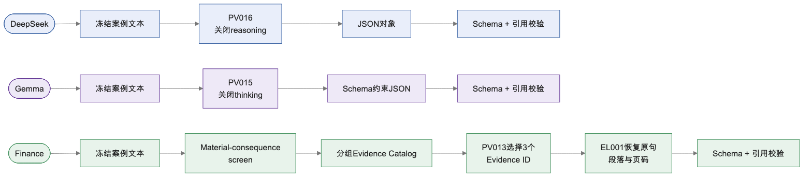
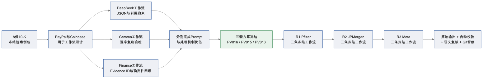
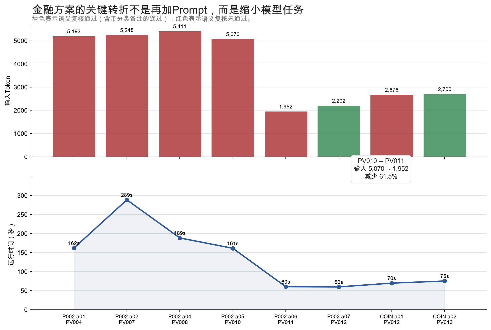
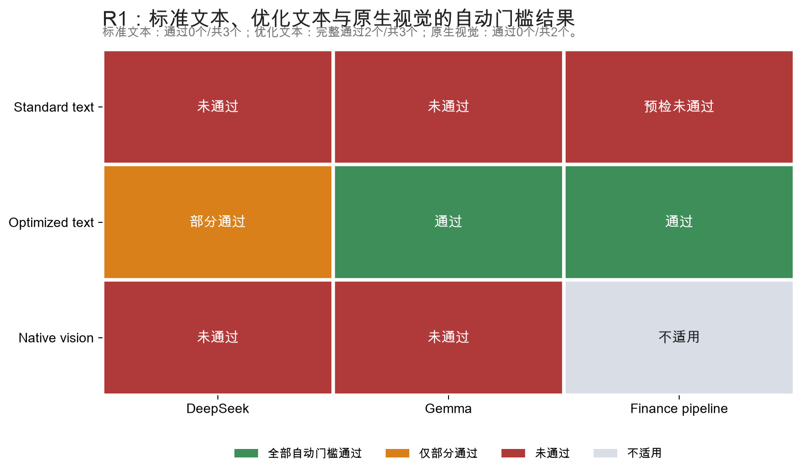
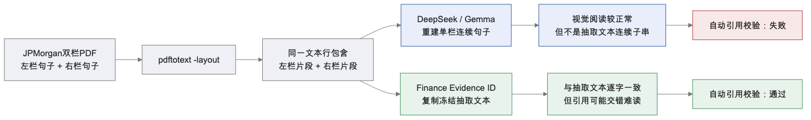
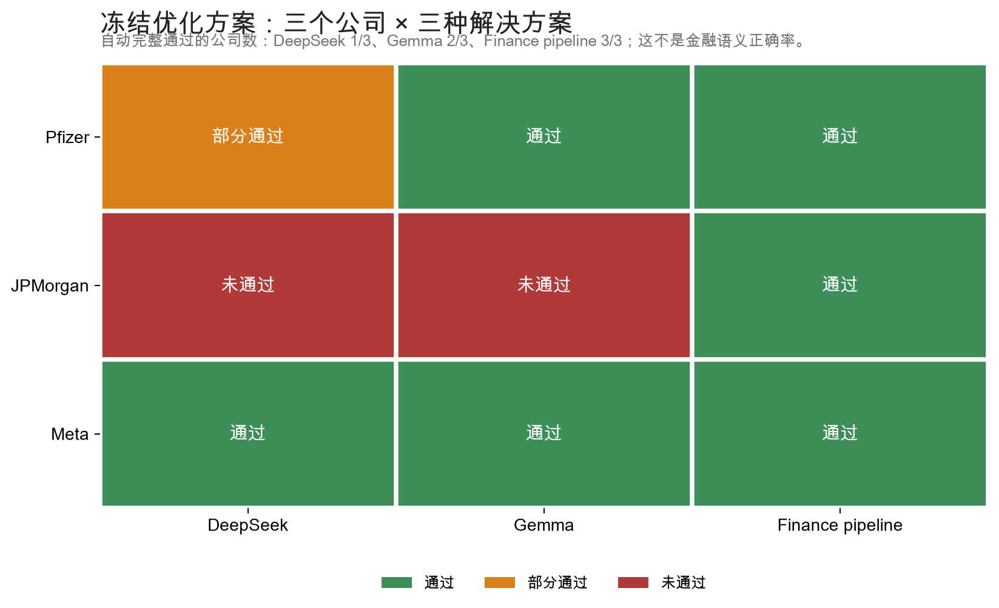
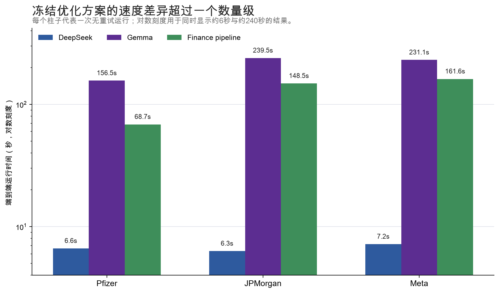
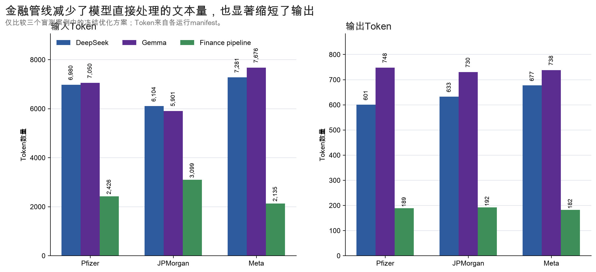

# Financial filing extraction：从 10-K 风险原文到可核验证据

**课程：** SHBI-GB 7343 — AI in Finance 
**小组：** Group 7 
**项目：** Mini-exercise: financial filing extraction 
**报告状态：** 实验事实与技术过程稿；结论暂留空，等待小组基于证据共同提炼 
**实验日期：** 2026-09-02

---

## 摘要

课程任务看似简单：给模型一段 10-K 的 Risk Factors，要求识别三个重大风险、引用支持原文并分类。真正执行后，我们发现这不是一个单纯的“问三个模型同一道题、比较答案好坏”的问题。模型可能找到了合理风险，却改写了引用；可能逐字复制了文本，却复制到被双栏 PDF 打乱的句子；也可能输出了金融上听起来合理、但原文没有支持的分析。

因此，本项目比较的对象最终不是三个裸模型，而是三种经过场景化优化的解决方案：云端通用模型 DeepSeek、本地通用模型 Gemma，以及本地金融模型配合确定性证据管线。准备阶段使用 PayPal 和 Coinbase，目标是分别为三个模型设计最合适的 Prompt、输出约束和处理机制；该阶段的运行不参与模型排名。方案冻结后，才使用 Pfizer、JPMorgan Chase 和 Meta 三个未参与调优的案例进行无重试比较。所有输入、Prompt、原始响应、解析结果、自动评价、Token、延迟和哈希均被保留。

本报告先完整陈列实验设计、优化轨迹、量化结果和关键失败案例。最终实验结论暂不填写，避免在读完证据前先套用一个显而易见但信息量不足的答案。

---

## 1. 先把任务说清楚

### 1.1 什么是 10-K Risk Factors

Form 10-K 是美国上市公司向 SEC 提交的年度报告。Item 1A “Risk Factors” 是公司正式披露可能对业务、经营结果、财务状况或未来表现造成重大不利影响的风险部分。

这里的“风险”不是泛泛的负面话题，而通常包含三个要素：

1. **风险驱动因素**：什么事件或条件可能发生；
2. **影响机制**：它如何影响收入、成本、利润、现金流、资本、业务连续性或声誉；
3. **不确定性**：公司往往不能准确预测发生概率、时间和损失规模。

### 1.2 什么叫“重大风险”

本项目没有把英文 `material` 简单理解成“文本里出现了 material 这个词”。重大风险是指：根据公司披露，它有能力对业务或财务结果产生实质影响，并且值得投资者在首次风险筛查中优先关注。

例如，一家制药公司的风险因素可能写到：政府药品定价规定会降低部分产品收入；仿制药或竞争产品上市会侵蚀销量和价格；第三方研发伙伴中断合作会延误项目。三者都不只是“有竞争”“有监管”这种主题标签，而有明确的财务或经营后果。

### 1.3 风险类型如何分类

为了让不同模型可以比较，我们冻结了六类主分类：

| 主类型 | 判断重点 | 典型例子 |
|---|---|---|
| Strategic / Market / Technology | 需求、竞争、定价、产品采用、技术替代、战略关系 | 仿制药竞争、广告需求下降 |
| Operational / Supply Chain | 服务中断、供应商、生产、物流、系统运营 | 第三方服务故障、关键原料短缺 |
| Regulatory / Legal / Geopolitical | 法规、执法、诉讼、制裁、政治冲突 | 药品价格法规、监管处罚 |
| Financial / Liquidity / Credit | 利率、信用、融资、流动性、资本损失 | 信贷恶化、融资成本上升 |
| Cybersecurity / Data / Privacy | 网络攻击、数据泄露、隐私合规 | 用户数据泄露、平台安全事件 |
| Other | 无法由以上五类合理覆盖 | 特殊公司风险 |

一个风险可能横跨多个维度，但输出只保留一个“主类型”。分类依据应是**主要驱动因素**，而不是句子里碰巧出现的后果。例如，“战略合作伙伴的服务中断”究竟属于战略还是运营，需要先判断该句强调的是合作关系本身，还是服务可用性。

### 1.4 模型必须交付什么

每次运行必须返回恰好三个风险。核心字段为：

- 风险摘要；
- 一个主风险类型；
- 逐字支持原文；
- 原文段落 ID；
- PDF 物理页码。

最终核心 Schema 位于 [`schemas/risk-output-core.schema.json`](../schemas/risk-output-core.schema.json)。分析理由、金融影响、时间范围、监控指标和缓释措施等扩展字段，在没有原文支持时必须明确放弃回答，不能用常识补齐。

---

## 2. “0/3”究竟是什么意思

本报告不再单独使用容易误读的 `0/3`。统一写成完整句子：

> **通过 0 个，未通过 3 个（通过率 0%）。**

这里的分母是该条件下实际运行或可运行的模型数量，分子是通过全部自动门槛的模型数量。因此：

- “通过 0 个，未通过 3 个”表示三个都没有完整通过；
- 它不表示“0 个错误”；
- “DeepSeek 自动完整通过 1 个公司、共 3 个公司”表示三个盲测公司中只有一个满足全部自动门槛；
- 原生视觉条件只有两个可运行模型，因此写“通过 0 个，未通过 2 个（共 2 个可运行模型）”，不能写成 0/3。

### 2.1 三种结果状态

| 状态 | 精确定义 |
|---|---|
| 完整通过 | JSON 可解析、Schema 合法、案例/模型/Prompt 元数据正确，并且三条引用全部通过原文匹配 |
| 部分通过 | 已产生可用结构化答案，但至少一条引用或其他核心门槛未通过 |
| 未通过 | 没有可用最终答案、预检即失败，或核心自动门槛大面积失败 |

### 2.2 自动通过不等于金融语义正确

自动评价回答的是：“输出能不能被程序可靠读取和定位回冻结文本？”它不自动回答以下问题：

- 这三个风险是否真的是最值得关注的三个；
- 引用是否足以证明摘要中的全部因果后果；
- 风险分类是否符合主要驱动因素；
- PDF 抽取文本本身是否已经被版式打乱。

所以报告中始终把两层结果分开：

1. **自动门槛**：结构、元数据、引用字符串与定位；
2. **语义复核**：重大性、证据充分性、分类与金融含义。

---

## 3. 比较对象：三个模型，三种最终方案

| 方案 | 模型 | 运行位置 | 最终 Prompt / Profile | 最终输入方式 |
|---|---|---|---|---|
| 通用云端 | `DeepSeek-V4-Flash-Vision-Exp` | 云端 API | `PV016` / `optimized-deepseek-text-v005` | 冻结文本直接输入 |
| 通用本地 | `gemma4:26b-a4b-it-q4_K_M` | 本地 Ollama | `PV015` / `optimized-gemma-text-v004` | 冻结文本直接输入 |
| 金融专门 | `QuantFactory/Llama-3-8B-Instruct-Finance-RAG-GGUF:Q4_K_M` | 本地 GGUF | `PV013` / `optimized-finance-pipeline-v009` | 候选证据目录 + 确定性回填 |

### 3.1 三个模型的背景与选择理由

三个模型并非只是“云端、通用本地、金融本地”三个标签。它们在开发者、模型规模、训练目标、开放方式和运行机制上都有明显差异，这些差异直接影响后续方案设计。

| 模型 | 开发与来源 | 架构或规模 | 原始定位 | 本实验选择它代表什么 |
|---|---|---|---|---|
| DeepSeek-V4-Flash-Vision-Exp | DeepSeek 官方 API 实验模型 | 官方资料未公开参数量与权重；云端托管 | 通用多模态、推理、Agent 与工具使用 | 能直接调用的高能力通用云端方案 |
| Gemma 4 26B A4B IT | Google DeepMind 开放权重模型；本地为 Ollama Q4_K_M 版本 | MoE；官方标注约 25.2B 总参数、3.8B 激活参数 | 通用文本、视觉、推理与工具使用 | 数据留在本机的高能力通用模型方案 |
| Llama-3-8B-Instruct-Finance-RAG | Meta Llama 3 8B Instruct 的金融 LoRA 微调版；QuantFactory 转为 GGUF | 8B；本实验使用 Q4_K_M 量化 | 根据给定 10-K 上下文回答金融问题 | 小型、可本地运行、经过金融任务适配的专门模型方案 |

#### 3.1.1 DeepSeek-V4-Flash-Vision-Exp

这是 DeepSeek 于 2026 年 8 月 21 日上线的实验性多模态 API 模型。根据 [DeepSeek 官方发布说明](https://api-docs.deepseek.com/news/news260821/)，它在文本能力上与 DeepSeek-V4-Flash 对齐，并增加图像理解；官方接口同时支持 Chat Completions、Responses、JSON 输出、工具调用，以及 thinking / non-thinking 两种模式。[官方模型说明](https://api-docs.deepseek.com/quick_start/pricing/)列出的服务上下文长度为 1M Token，但参数量、权重和具体网络结构没有公开，因此本报告不把它描述成某个未经证实的参数规模。

本实验选择它，不是因为它接受过金融专项训练，而是因为它代表常见的生产路径：通过云端 API 获得较强的通用语言与视觉能力，不需要在本地加载模型。对应代价是文件内容需要发送给外部服务，运行依赖网络和供应商接口，并产生按 Token 计量的调用成本。

它与 10-K 任务的直接关系有两点。第一，通用模型需要仅凭 Prompt 理解“重大风险、逐字引文、主风险类型和页码定位”等金融披露要求；第二，它原生支持图像，因此可以测试直接读取 10-K 页面截图是否优于文本抽取。准备阶段暴露的主要适配问题不是金融知识不足，而是默认 reasoning 会占用最终输出预算。

#### 3.1.2 Gemma 4 26B A4B IT Q4_K_M

Gemma 是 Google DeepMind 基于 Gemini 研究与技术推出的开放权重模型家族。本实验使用 instruction-tuned 的 Gemma 4 26B A4B。根据 [Google 官方 Gemma 4 模型卡](https://ai.google.dev/gemma/docs/core/model_card_4)，该版本采用 Mixture-of-Experts（MoE）架构，约有 25.2B 总参数，但每次推理只激活约 3.8B 参数；`A4B` 表示约 4B 激活参数。官方版本支持文本和图像，原生上下文长度为 256K Token，并具有可开关的 thinking 模式。

本地 `ollama show` 返回的实际安装包信息为 `gemma4` 架构、约 25.8B 参数、262,144 Token 原生上下文、支持 completion、vision、tools 和 thinking；脱敏后的命令输出保存在 [`report/data/gemma_runtime_snapshot.txt`](data/gemma_runtime_snapshot.txt)。模型名称末尾的 `Q4_K_M` 表示使用 K-quant 的 4-bit 中等量化版本：它以一定精度损失换取更小的内存占用和本地运行可行性。本实验进一步把 harness 上下文限制为 32,768 Token，而不是直接使用模型声明的全部上限。

选择 Gemma 的目的，是设置一个与 DeepSeek 同属通用多模态模型、但可以完全在本地运行的方案。它没有针对金融 10-K 专门微调，因此需要通过 Prompt 学会本任务的风险选择、分类和逐字证据规则；同时，本地部署使文件不需要传给云端。准备阶段最关键的适配是关闭 thinking，并把逐字复制过程拆成明确自检步骤。

#### 3.1.3 Llama-3-8B-Instruct-Finance-RAG-GGUF Q4_K_M

这个名称包含三层来源，不能把它简单理解成一个从零训练的“金融大模型”：

1. 基础模型是 Meta 的 Llama 3 8B Instruct；
2. `curiousily/Llama-3-8B-Instruct-Finance-RAG` 使用 LoRA，在 `virattt/financial-qa-10K` 的 4,000 个样本上进行金融问答微调；
3. QuantFactory 再使用 llama.cpp 将其转换并量化为 GGUF，本实验选择 `Q4_K_M` 版本。

这些来源和训练说明可在 [QuantFactory 模型卡](https://huggingface.co/QuantFactory/Llama-3-8B-Instruct-Finance-RAG-GGUF)中逐级核对。模型卡显示 `Q4_K_M` 文件约 4.92 GB，本实验通过 llama.cpp 在本地以 8,192 Token 上下文运行。

名称中的 `RAG` 不表示该模型会自动搜索、建立索引或取回 10-K。它的训练格式是“给出 question 和 context，再依据 context 回答”。检索和上下文准备仍必须由外部程序完成。这个训练背景解释了为什么它在最终方案中适合从候选证据目录里选择 Evidence ID，却不适合独立承担 PDF 解析、全文检索、严格 JSON、段落 ID 和页码恢复等全部任务。

选择它的目的，是观察一个规模较小、能在本地运行、且见过 10-K 金融问答数据的模型，能否通过更贴近其训练方式的工作流完成风险抽取。它与 Gemma 的区别不只是参数更少，而是训练目标更窄：Gemma 是通用推理与多模态模型；Finance-RAG 更接近“根据已经提供的金融证据回答问题”的专门组件。

#### 3.1.4 这组三模型比较实际代表什么

本实验没有把“云端、本地、金融”视为三个互斥能力等级，而是用它们代表三条可实施路线：

- **云端通用路线**：模型能力和调用便利性优先；
- **本地通用路线**：隐私与本地控制优先，同时保留较强通用能力；
- **本地金融专门路线**：使用更小的领域微调模型，并由外部证据管线补足它不擅长的工作。

因此，后续比较的不是“模型名字谁更高级”，而是三种背景不同的模型经过适配后，哪种完整方案更适合 10-K 风险证据抽取。

### 3.2 共同运行控制

共同的主要生成参数为 `temperature = 0`、`top_p = 1`、`max_output_tokens = 1600`、`seed = 7343`。Gemma 使用 32,768 Token 上下文；金融模型使用 8,192 Token 上下文。配置原件见 [`harness/config/models.json`](../harness/config/models.json) 与 [`harness/config/profiles.json`](../harness/config/profiles.json)。

DeepSeek 官方服务支持更大的上下文，Gemma 本地模型也声明 256K 原生上下文，但本实验没有按各模型最大容量填满输入。上下文上限、输出预算和采样参数属于实验运行控制，不等同于模型厂商公布的理论最大能力。

### 3.3 为什么这项任务需要 Token 预算

本实验要求每个方案完成同一项可交付工作：从一段较长的 10-K 风险因素中选出三个重大风险，并为每项风险返回摘要、分类、逐字引文和原文定位。初始输出 Schema 还要求理由、金融影响、时间范围、监控指标、缓释措施和不确定性。它是一个有明确交付边界的结构化抽取任务，而不是不限长度的金融评论。

固定输出预算有三项与任务直接相关的作用：

| 任务问题 | Token 预算的作用 |
|---|---|
| 三个模型可能采用完全不同的回答长度 | 设定同一生成上限，避免某个模型通过无限扩写获得更多作答空间 |
| 10-K 原文已经占用大量上下文 | 必须提前为最终 JSON 留出空间，否则输入虽然能放入，答案却无处生成 |
| 云端调用与本地推理都产生时间和资源成本 | 把“能否在有限资源内交付可复核结果”纳入方案测试，而不只比较不受约束的最高输出质量 |

因此，1,600 Token 在本实验中是一个**运行约束和控制变量**，不是评分目标。模型不会因为少用 Token 自动获得更高质量分，也不要求把答案写满 1,600 Token。这个上限在查看正式输出前已经固定，并在标准方案与模型专属优化方案中保持不变，使优化结果能够归因于 Prompt、推理开关、Schema 或证据管线，而不是简单给某个失败方案增加更多生成空间。

1,600 也不是经过单独消融实验得到的“最优数字”。它被设置为足以容纳三个完整结构化风险项、同时限制冗长生成的统一上限。最终成功输出实际使用约 182–748 Token，说明在职责和格式设计正确时，完成核心任务不需要耗尽该上限；P001 中恰好用满 1,600 Token 却没有最终答案，反而揭示了预算被内部推理消耗的问题。

换言之，本实验测试的不是“给模型无限 Token 时能否答题”，而是“在一个可控制、可比较、适合进入分析工作流的资源边界内，哪种方案能够完成三个风险的可核验抽取”。

### 3.4 Token 预算如何进入一次调用

Token 是模型处理文字时使用的计量单位，不等同于汉字数或英文单词数。一次调用需要同时考虑两种容量：

- **上下文窗口**：模型一次能够容纳的总信息量，包括系统指令、Prompt、10-K 文本和生成输出；
- **输出预算**：本实验允许模型在一次调用中生成的最大 Token 数，统一设为 1,600。

运行前的上下文预检采用以下约束：

> 输入 Token + 预留输出 Token ≤ 模型上下文窗口

例如，金融模型在 Pfizer 标准文本条件下需要 6,840 个输入 Token。加上 1,600 个预留输出 Token 后总计 8,440，超过其 8,192 Token 上下文窗口，因此该调用在发送前即被标记为“预检未通过”。预检失败表示请求容量不成立，不表示模型已经生成了错误答案。

DeepSeek 的 `reasoning` 和 Gemma 的 `thinking` 还会占用生成预算。在本实验所使用的接口与运行配置中，内部推理内容与最终可见答案共享 1,600 Token 上限。如果推理过程耗尽全部预算，运行记录会显示 1,600 个输出 Token，但用户看不到最终 JSON。后文所说的“reasoning/thinking 占满预算”特指这一失败机制。

Token 还依赖各模型的 tokenizer，因此跨模型 Token 数适合衡量各自方案实际处理了多少输入、产生了多少输出，但不能直接换算成完全等价的算力单位。

优化阶段结束后，三者已不再是同一种“裸模型调用”。本实验比较的是在同一业务任务与核心输出契约下，针对各模型特点设计的三种完整解决方案。

DeepSeek 和 Gemma 最终直接阅读案例文本并生成完整 JSON。金融模型受 8K 上下文和较弱结构化输出能力限制，最终只负责从候选证据中选择三个 Evidence ID、给出摘要与分类；程序再按 ID 原样恢复引用、段落和页码。

---

## 4. 实验路线与可回查记录

### 4.1 数据池与案例分工

项目共整理八份公开 10-K：NVDA、COIN、PYPL、BA、JPM、TSLA、PFE 和 META。每份材料都保留：

- 官方或发行人公开 PDF；
- `pdftotext -layout` 生成的机械抽取文本；
- Item 1A 文本；
- 固定短案例包；
- PDF 物理页、印刷页、段落 ID 与定位索引；
- 来源 URL、SEC accession 和 SHA-256。

数据来源与角色见 [`data/manifests/filings.csv`](../data/manifests/filings.csv) 和 [`data/manifests/case_packets.json`](../data/manifests/case_packets.json)。模型输入里没有人工答案、风险标签或分析师结论。

实际用于本报告的案例分工如下：

| 阶段 | 公司 | 在实验设计中的角色 | 是否进入方案横向比较 |
|---|---|---|---|
| P001 / P002 | PayPal、Coinbase | 方案设计：分别优化 Prompt、推理设置、输出契约与证据处理机制 | 不进入；运行结果只用于解释设计迭代 |
| R1 | Pfizer | 冻结方案的第一轮评估，同时保留标准文本、优化文本与原生视觉条件 | 进入 |
| R2 | JPMorgan Chase | 冻结优化方案的跨行业评估 | 进入 |
| R3 | Meta | 冻结优化方案的跨行业评估 | 进入 |

### 4.2 方案设计阶段与冻结评估阶段

P001 / P002 的首要目标是完成方案设计，而不是测量或排列三个模型的性能。PayPal 和 Coinbase 提供可反复检查的开发材料；根据每次暴露的具体问题，可以继续修改 Prompt、关闭不合适的推理模式、收缩输出 Schema，或把不适合生成模型完成的定位工作移交给确定性程序。三个方案不要求经历相同数量的修改，也不以准备阶段的通过次数、失败次数、延迟或 Token 排名。

准备阶段的停止条件是：每种模型都形成一套能够完成课程核心任务、且错误机制得到解释的候选方案。随后冻结 DeepSeek `PV016`、Gemma `PV015` 和 Finance pipeline `PV013`。只有冻结后在 Pfizer、JPMorgan Chase 和 Meta 上产生的结果，才用于比较三种方案的跨案例表现、延迟和输入输出规模。

这种分工使报告中的两类证据承担不同作用：准备阶段回答“每种方案为什么设计成现在这样”，冻结评估阶段回答“设计完成后三种方案在新案例上表现如何”。

### 4.3 每一次调用保留了什么

基本实验单元是“一个模型 × 一个案例 × 一次尝试”。每个 run 目录分别保存：

- 实际输入与 Prompt；
- 脱敏请求；
- provider 原始 JSON 和原始文本；
- 解析后的 JSON；
- 自动评价；
- manifest、Token、延迟、状态与 Git commit；
- 文件校验哈希。

失败运行也保留，不被后一次尝试覆盖。总索引见 [`experiments/INDEX.csv`](../experiments/INDEX.csv)，留痕规则见 [`EXPERIMENT_ARCHIVE.md`](../EXPERIMENT_ARCHIVE.md)。

---

## 5. 准备阶段的起点：共同 Prompt 暴露三类设计问题

P001 使用 PayPal、相同 `PV001` Prompt、相同核心任务与 1,600 Token 输出预算，作为三个方案设计的共同起点。目的不是根据这一次运行判断模型优劣，而是观察同一通用 Prompt 在不同模型上暴露哪些适配问题，并据此建立三条独立的优化路线。其结果分别对应 3.3–3.4 节介绍的输出预算耗尽，以及结构化输出控制问题。

| 模型 | 开发阶段观察 | 时间 | 输入 / 输出 Token | 暴露的方案设计问题 |
|---|---|---:|---:|---|
| DeepSeek | 未通过 | 14.554 秒 | 5,284 / 1,600 | 1,600 个输出 Token 全部被 reasoning 消耗，没有可见答案 |
| Gemma | 未通过 | 203.388 秒 | 5,466 / 1,600 | thinking 消耗完输出预算，没有可见答案 |
| Finance | 未通过 | 138.422 秒 | 5,199 / 487 | 返回散文而非 JSON，引用和页码不可靠 |

P001 的诊断价值在于识别出三种不同的方案适配问题：

- DeepSeek 的问题首先是推理预算与输出预算冲突；
- Gemma 同样需要关闭 thinking，但本地生成速度慢得多；
- 金融模型虽然能说出风险，却不能独立稳定完成结构化输出与定位。

据此，后续准备过程分为三条独立设计路线，分别处理推理预算、逐字引用和结构化定位问题。详细诊断见 [`experiments/P001_SMOKE_DIAGNOSIS.md`](../experiments/P001_SMOKE_DIAGNOSIS.md)。

---

## 6. DeepSeek：从“没有答案”到快速结构化抽取

### 6.1 优化链

| 版本 / 案例 | 改动 | 观察结果 | 为何继续调整 |
|---|---|---|---|
| `PV001` / PYPL | 通用证据优先 Prompt | reasoning 占满预算，无答案 | 关闭 reasoning，强制 JSON |
| `PV002` / PYPL | 关闭 reasoning，要求 JSON | 9.129 秒；已有 JSON，但数组字段被输出成标量 | 把每个字段类型写进 Prompt |
| `PV005` / PYPL | 明确数组、对象与逐字引用规则 | 9.923 秒；自动门槛全部通过 | 转到第二个开发案例 |
| `PV005` / COIN | 同一 Prompt 泛化 | 自动通过，但扩展分析字段出现原文外推断 | 收缩到课程核心任务 |
| `PV014` / COIN | Core-only Schema | 6.075 秒；嵌套结构不合法 | 明确每层对象和数组形状 |
| `PV016` / COIN | 显式嵌套字段类型 | 6.406 秒；自动与语义复核通过 | 冻结 |

### 6.2 最有效的改动是什么

DeepSeek 方案从不可交付变为可交付，并不依赖增加更多金融知识，而来自三个结构性改动：

1. **关闭 reasoning**：避免内部推理吃掉 1,600 Token 的最终答案预算；
2. **把 JSON 类型写明**：例如 `source_pages` 必须是整数数组，不能写成单个数字；
3. **收缩输出职责**：只要求课程真正需要的摘要、分类、逐字引文与定位，其他字段明确 abstain。

`PV014` 还说明“使用更小 Schema”不必然自动成功。如果 Prompt 没有明确写出 `risks` 是对象数组、每个对象包含哪些字段，模型仍可能生成语义正确但结构不合法的 JSON。最终冻结 Prompt 见 [`prompts/PV016.md`](../prompts/PV016.md)。

### 6.3 最终方案的行为特征

冻结后 DeepSeek 是三种方案中最快的，三个盲测案例分别用时 6.641、6.311 和 7.195 秒。但快速不等于每次都能逐字复制：Pfizer 中一条原文是 `certain drug pricing provisions`，模型引用成 `The drug pricing provisions`，因此只能记为部分通过。

---

## 7. Gemma：把“会分析但抄不准”改成逐字证据输出

### 7.1 优化链

| 版本 / 案例 | 改动 | 观察结果 | 为何继续调整 |
|---|---|---|---|
| `PV001` / PYPL | 通用 Prompt | thinking 占满预算，无答案 | 关闭 thinking，强制 Schema |
| `PV003` / PYPL | 关闭 thinking，结构化输出 | 133.085 秒；结构与元数据正确，但 3 条引用中 1 条漏了一个词 | 加入逐字复制自检步骤 |
| `PV006` / PYPL | 六步 literal-line copy check | 118.198 秒；全部自动门槛通过 | 转到 COIN |
| `PV006` / COIN | 同一规则泛化 | 158.015 秒；通过，但仍输出非核心分析 | 收缩到 Core-only |
| `PV015` / COIN | 只保留核心字段，非核心明确放弃 | 157.559 秒；自动与语义复核通过 | 冻结 |

### 7.2 六步逐字复制检查解决了什么

Gemma 第一次结构化尝试已经很接近成功：三个风险合理、JSON 也能解析，但有一条引文少了一个词。对人来说差异很小，对可核验证据来说却意味着“模型生成了近似句子”，而不是从原文复制。

`PV006` 因此把动作拆成：找到完整支持句、从输入直接复制、禁止同义改写、检查每个词与标点、再填写页码和段落。这个改动不是提升金融推理，而是约束输出行为。最终 `PV015` 又移除了容易诱发自由发挥的非核心字段。冻结 Prompt 见 [`prompts/PV015.md`](../prompts/PV015.md)。

### 7.3 最终方案的行为特征

Gemma 在 Pfizer 和 Meta 两个盲测案例完整通过自动门槛；在 JPMorgan 的三条引用中只有一条通过冻结文本的连续字符串匹配。它的主要代价是时间：三个盲测案例分别耗时 156.519、239.547 和 231.120 秒。

Meta 的结果还暴露了一个比逐字复制更细的问题：部分引文虽然完全来自原文，却只截取了“风险驱动因素”，没有带上摘要中所声称的“后果”。这类输出会自动通过，但证据证明力不完整。

---

## 8. Finance：最重要的优化不是 Prompt，而是重新划分模型职责

金融模型的完整方案设计过程共有十个被记录的节点，是本项目最有信息量的工程轨迹。这些节点用于说明设计选择如何形成，不作为金融模型与另外两个模型之间的成绩比较。

### 8.1 十个节点发生了什么

| 节点 | Prompt | 自动门槛 | 语义复核 | 关键变化或失败原因 |
|---|---|---|---|---|
| P001 baseline | `PV001` | 未通过 | 未通过 | 散文输出，引用与定位不可靠 |
| P002 a01 | `PV004` | 未通过 | 未通过 | 加 JSON 契约后，页码仍错误 |
| P002 a02 | `PV007` | 未通过 | 未通过 | 把页码状态机写进 Prompt，反而退化到 288.642 秒 |
| P002 a03 | `PV008` | 预检未通过 | 未运行 | 冗长 Evidence Catalog 导致 9,429 + 1,600 超过 8,192 上下文 |
| P002 a04 | `PV008` | 通过 | 未通过 | 压缩为物理行 ID；引用可定位，但单行证据不完整且主题外扩 |
| P002 a05 | `PV010` | 通过 | 未通过 | 改用完整句；非核心分析仍出现原文外推断 |
| P002 a06 | `PV011` | 通过 | 未通过 | Core-only + consequence screen；把 copyrighted material 中的 material 错当重大性信号，并选出重复主题 |
| P002 a07 | `PV012` | 通过 | 通过 | 修复 materiality 规则，加入段落组唯一性 |
| COIN a01 | `PV012` | 通过 | 未通过 | 证据正确，但主驱动分类优先级不清 |
| COIN a02 | `PV013` | 通过 | 带分类备注通过 | 增加 primary-driver precedence 后冻结 |

### 8.2 为什么“把页码规则写得更详细”失败了

`PV007` 试图让 8B 金融模型自己维护当前页码、段落和引文状态。结果不仅没有解决定位，输出反而更长、更慢，仍然给出不可靠页码。这说明对这个模型而言，文本定位是一个不适合继续用自然语言 Prompt 堆规则解决的确定性任务。

### 8.3 Evidence ID 管线如何工作

从 `PV008` 开始，工作被拆成两部分：

1. 程序从冻结案例包生成不可变的 Evidence Catalog；每条记录有 `evidence_id`、原文、段落组、PDF 页和文本哈希；
2. 模型只选择三个 Evidence ID，并生成风险摘要与分类；
3. `EL001` 检查 ID 存在、互不重复、属于不同段落组；
4. 程序按 ID 原样恢复引文、段落和页码；
5. 最终输出再对冻结原文执行 Schema 和引用校验。

定位程序不会模糊搜索相似句、修补模型引文或替模型选择另一个证据。详细协议见 [`experiments/P_PROTOCOL_ADDENDUM_v002.md`](../experiments/P_PROTOCOL_ADDENDUM_v002.md)，实现见 [`scripts/lib/evidence_catalog.cjs`](../scripts/lib/evidence_catalog.cjs) 与 [`scripts/apply_evidence_locator.cjs`](../scripts/apply_evidence_locator.cjs)。

### 8.4 为什么候选证据还要继续缩小

把全文每一行都送给模型仍然会超过 8K 上下文。后续版本逐步做了三次收缩：

- 物理行目录：Token 少，但句子被换行切断；
- 完整句目录：证据更可读，但模型还会输出没有根据的 horizon、indicator 等扩展分析；
- Core-only + material-consequence screen：只保留有明确后果语言的完整候选句，只让模型负责摘要、分类和 ID 选择。

从 `PV010` 到 `PV011`，输入从 5,070 Token 降到 1,952 Token，减少 **61.5%**；运行时间从 161.398 秒降到 60.424 秒，减少约 **62.6%**。这次提升不是“模型变聪明”，而是模型需要完成的任务更小、更清楚。

### 8.5 false positive 如何反过来改进规则

第一版 material-consequence screen 只要看到 `material` 就可能把句子留下，结果把 `copyrighted material` 中的普通名词 material 当作“重大影响”。第二版要求重大性词必须修饰影响动词，并加入段落组 ID，避免同一风险段落的两句话被当成两个独立重大风险。

Coinbase 又暴露了分类冲突：句子同时包含战略合作关系和第三方服务语言。`PV013` 因此加入主驱动优先级：需求、价格、竞争、采用和战略合作优先归到 Strategic / Market / Technology；只有当重点是服务依赖或中断时，第三方参与才归 Operational。

最终冻结 Prompt 见 [`prompts/PV013.md`](../prompts/PV013.md)，COIN 收口复核见 [`experiments/P002_COIN_FINAL_REVIEW.md`](../experiments/P002_COIN_FINAL_REVIEW.md)。

---

## 9. R1 Pfizer：同一个案例，三种输入条件

R1 使用冻结前未参与调优的 Pfizer FY2024 案例。八个可运行单元全部只执行一次，没有重试。

### 9.1 结果表

| 条件 | 模型 | 结果 | 时间 | 输入 / 输出 Token | 具体含义 |
|---|---|---|---:|---:|---|
| 标准文本 | DeepSeek | 未通过 | 16.183 秒 | 6,898 / 1,600 | reasoning 占满预算，无最终答案 |
| 标准文本 | Gemma | 未通过 | 246.034 秒 | 7,032 / 1,600 | thinking 占满预算，无最终答案 |
| 标准文本 | Finance | 预检未通过 | — | 6,840 / — | 6,840 输入 + 1,600 输出预留超过 8,192 上下文 |
| 优化文本 | DeepSeek | 部分通过 | 6.641 秒 | 6,980 / 601 | Schema 通过；三条引文中两条通过 |
| 优化文本 | Gemma | 完整通过 | 156.519 秒 | 7,050 / 748 | 全部自动门槛通过 |
| 优化文本 | Finance pipeline | 完整通过 | 68.676 秒 | 2,426 / 189 | 三个 Evidence ID 与确定性定位通过 |
| 原生视觉 | DeepSeek | 未通过 | 16.138 秒 | 1,851 / 1,600 | reasoning 占满预算，无最终答案 |
| 原生视觉 | Gemma | 未通过 | 188.465 秒 | 1,514 / 1,600 | thinking 占满预算，无最终答案 |

用完整句表达：

- 标准文本条件：**通过 0 个，未通过 3 个（通过率 0%）**；
- 优化文本条件：**完整通过 2 个，部分通过 1 个（共 3 个）**；
- 原生视觉条件：**通过 0 个，未通过 2 个（共 2 个可运行模型）**；金融模型不支持该条件，记为不适用。

### 9.2 优化方案选出的风险是否完全一样

不一样，而且不应因为不一样就自动判错。

- Gemma：付款方议价能力、竞争产品上市、第三方合作方中断；
- Finance pipeline：仿制药竞争、监管与产品收入暴露、假药/网络安全相关消费者伤害；
- DeepSeek：药品定价法规、竞争产品与仿制药、假冒产品。

同一份 10-K 可以存在多组原文支持的“前三风险”。课程任务的难点之一，正是不能把分析师的一组选择机械当成唯一答案。完整 R1 摘要见 [`experiments/R1_PFE_SUMMARY.md`](../experiments/R1_PFE_SUMMARY.md)。

---

## 10. R2 JPMorgan：双栏 PDF 让“模型错误”与“抽取错误”混在一起

JPMorgan 案例是本实验最值得展示的失败案例。它没有给出一个简单的赢家，而是暴露了自动评价如何被文档版式影响。

### 10.1 发生了什么

JPMorgan 年报使用双栏版式。`pdftotext -layout` 在部分页面把左栏和右栏同一高度的文字拼进同一行。视觉上，每一栏分别是连续、可读的句子；在序列化文本里，两栏碎片却交错在一起。

因此出现三种不同现象：

- **DeepSeek** 生成了视觉上可在单栏找到的连续措辞，但该措辞不是冻结文本里的连续子串，三条引用全部被自动 gate 拒绝；
- **Gemma** 三条引用只有一条通过；另有一条在页面图像里成立，但在冻结文本中被另一栏插断；同时把印刷页 18 写成 PDF 物理页 20 规则下的错误页码；
- **Finance pipeline** 直接复制冻结文本，所以自动引用门槛全部通过，但它忠实复制的是已经交错的双栏文本，可读性和语义完整性反而更差。

### 10.2 自动结果

| 方案 | 自动结果 | 时间 | 输入 / 输出 Token | 自动层观察 |
|---|---|---:|---:|---|
| DeepSeek | 未通过 | 6.311 秒 | 6,104 / 633 | Schema/元数据通过，三条引用字符串均未匹配 |
| Gemma | 未通过 | 239.547 秒 | 5,901 / 730 | 三条引用仅一条匹配，一条页码混淆 |
| Finance pipeline | 完整通过 | 148.477 秒 | 3,099 / 192 | Evidence ID 与确定性定位全部通过 |

### 10.3 加入页面图像复核后，结果怎么变化

- DeepSeek 的监管执法、处置计划重组、经济与信用环境三个主题均有金融相关性，并可在页面视觉列中找到支持；但部分短引文没有覆盖摘要里的完整后果，因此更适合标为“带条件的部分结果”，而不是直接把三条都视为纯模型幻觉。
- Gemma 的监管解决、政治/地缘不确定性、利率与信用利差主题同样相关；但页码契约确实有一处独立错误，不能归因于双栏文本抽取。
- Finance pipeline 的第一项“诉讼暴露”更接近 Regulatory / Legal，而不是 Strategic；“不利经济条件”更接近 Financial / Market，而不是 Operational。它证明了逐字可定位，却没有自动证明分类正确。

### 10.4 这个案例对评价设计的具体影响

JPMorgan 结果要求我们把至少四件事分开计分：

1. 原始 PDF 页面上的视觉证据是否存在；
2. 抽取文本是否保持正确阅读顺序；
3. 模型是否忠实引用它实际收到的输入；
4. 摘要和分类是否得到证据充分支持。

如果只看字符串匹配，DeepSeek 和 Gemma 会被过度惩罚；如果只看页面大意，模型的页码和证据截断错误会被忽略；如果只看 Finance 的自动通过，又会奖励“精确复制乱码式证据”。

---

## 11. R3 Meta：自动都通过以后，差别转移到证据质量

Meta 案例的抽取布局较干净，三种冻结优化方案全部通过自动门槛。

| 方案 | 自动结果 | 时间 | 输入 / 输出 Token | 语义复核观察 |
|---|---|---:|---:|---|
| DeepSeek | 完整通过 | 7.195 秒 | 7,281 / 677 | 用户参与、广告支出、广告信号三项均有充分原文支持；本轮最干净 |
| Gemma | 完整通过 | 231.120 秒 | 7,676 / 738 | 引文逐字正确，但部分只写驱动因素，未覆盖摘要中的后果 |
| Finance pipeline | 完整通过 | 161.604 秒 | 2,135 / 182 | 用户留存和广告定向较强；产品开发项归 Operational / Supply Chain 有争议 |

Meta 说明，当 JSON、定位和逐字引用都不再是主要问题后，模型差异会转移到更细的金融判断：选哪三个风险、引文截多长才足以证明结论、分类到底以驱动因素还是执行后果为主。

---

## 12. 跨案例量化比较

### 12.1 自动完整通过的公司数量

在三个冻结优化盲测案例中：

- DeepSeek：自动完整通过 **1 个公司，未完整通过 2 个公司（共 3 个）**；
- Gemma：自动完整通过 **2 个公司，未完整通过 1 个公司（共 3 个）**；
- Finance pipeline：自动完整通过 **3 个公司（共 3 个）**。

这组数字只代表自动可追溯门槛。JPMorgan 的双栏问题和 Finance 的分类问题已经说明，它不能直接解释成“金融分析准确率分别为 33%、67% 和 100%”。

### 12.2 时间

DeepSeek 三次均约 6–7 秒；Gemma 约 157–240 秒；Finance pipeline 约 69–162 秒。因为最快与最慢相差超过一个数量级，图中使用对数纵轴。

这不是纯模型吞吐 benchmark：Finance 的时间包含候选证据选择与管线处理，DeepSeek 包含远程 API 往返，Gemma 与 Finance 运行在不同本地推理栈。它衡量的是用户等待一个完整方案输出所需的端到端时间。

### 12.3 输入与输出 Token

DeepSeek 和 Gemma 直接阅读完整冻结案例，输入大约 5,900–7,700 Token；Finance pipeline 只读取筛选后的候选证据，输入约 2,100–3,100 Token。Finance 的输出也只有约 182–192 Token，因为模型只返回核心判断和 Evidence ID，完整引文与页码由程序恢复。

因此，Token 差异本身不能被表述成“金融模型更简洁”。更准确的说法是：金融方案把一部分文本处理和输出职责从生成模型移给了确定性程序。

### 12.4 结果总表

| 公司 | DeepSeek | Gemma | Finance pipeline |
|---|---|---|---|
| Pfizer | 部分通过；1 条近似改写引文 | 自动完整通过 | 自动完整通过 |
| JPMorgan | 自动未通过；页面视觉复核后属带条件部分结果 | 自动未通过；含双栏假阴性与真实页码错误 | 自动完整通过；证据交错且分类有误 |
| Meta | 自动完整通过；本轮最干净 | 自动完整通过；部分证据跨度偏短 | 自动完整通过；一项分类有争议 |

这张表比单一总分更接近真实结果：同一次输出可能在结构、引用、版式与金融分类四个维度得到不同评价。

---

## 13. 如何阅读和复核原始实验结果

为了在形成最终实验结论前独立核对证据，建议按以下顺序阅读，而不是只看汇总数字。

### 13.1 第一层：先看三份摘要

1. [`experiments/P002_COIN_FINAL_REVIEW.md`](../experiments/P002_COIN_FINAL_REVIEW.md)：三种方案为什么在准备阶段停止调优；
2. [`experiments/R1_PFE_SUMMARY.md`](../experiments/R1_PFE_SUMMARY.md)：Pfizer 三输入条件结果；
3. [`experiments/R2_R3_OPTIMIZED_SUMMARY.md`](../experiments/R2_R3_OPTIMIZED_SUMMARY.md)：JPMorgan 与 Meta 的自动结果和语义复核。

### 13.2 第二层：看具体 run，而不是只看表格

每个 run 可按同一顺序阅读：

1. `manifest.json`：确认模型、Prompt、案例、参数、延迟和 Token；
2. `input/model_input.txt`：确认模型实际看到了什么；
3. `raw/response.txt`：确认模型原始输出，没有被后处理改写；
4. `derived/parsed.json` 或 `derived/pipeline_output.json`：看结构化结果；
5. `evaluation/automatic.json`：看究竟是哪一条门槛通过或失败；
6. 对双栏或页码问题，再看案例包 `pages/*.png` 与 `locator_index.json`。

例如，DeepSeek 的 JPMorgan run 为：

[`experiments/runs/R2/R2-optimized-text-JPM-FY24-cloud-deepseek-20260902T065650192Z-e621ba-a01/`](../experiments/runs/R2/R2-optimized-text-JPM-FY24-cloud-deepseek-20260902T065650192Z-e621ba-a01/)

Finance pipeline 的 JPMorgan run 为：

[`experiments/runs/R2/R2-optimized-text-JPM-FY24-finance-llama-20260902T065650202Z-ad27f8-a01/`](../experiments/runs/R2/R2-optimized-text-JPM-FY24-finance-llama-20260902T065650202Z-ad27f8-a01/)

把这两个目录并排看，可以直接看到“视觉上合理但字符串失败”与“字符串精确但文本交错”的差异。

### 13.3 第三层：回看 Prompt 版本，不只看最终 Prompt

最终版本不足以解释优化过程。建议按模型阅读：

- DeepSeek：[`PV001`](../prompts/PV001.md) → [`PV002`](../prompts/PV002.md) → [`PV005`](../prompts/PV005.md) → [`PV014`](../prompts/PV014.md) → [`PV016`](../prompts/PV016.md)；
- Gemma：[`PV001`](../prompts/PV001.md) → [`PV003`](../prompts/PV003.md) → [`PV006`](../prompts/PV006.md) → [`PV015`](../prompts/PV015.md)；
- Finance：[`PV001`](../prompts/PV001.md) → [`PV004`](../prompts/PV004.md) → [`PV007`](../prompts/PV007.md) → [`PV008`](../prompts/PV008.md) → [`PV010`](../prompts/PV010.md) → [`PV011`](../prompts/PV011.md) → [`PV012`](../prompts/PV012.md) → [`PV013`](../prompts/PV013.md)。

每个改动都应与前一个失败现象对应。只有能够指向具体错误，并由后续运行验证效果的 Prompt 规则，才计为有效优化。

---

## 14. 可复现性与报告图表来源

本报告中的运行指标来自 [`experiments/INDEX.csv`](../experiments/INDEX.csv) 与各 run 的 `manifest.json`。用于绘图的人工复核汇总数据保存在：

- [`report/data/reviewed_results.csv`](data/reviewed_results.csv)
- [`report/data/finance_optimization.csv`](data/finance_optimization.csv)

图表源文件与渲染结果同时保留：

- 数值图表生成脚本：[`report/visuals/src/generate_report_charts.py`](visuals/src/generate_report_charts.py)
- Mermaid 图源：[`report/visuals/src/`](visuals/src/)
- PNG / SVG：[`report/visuals/rendered/`](visuals/rendered/)

所有数值图都由 CSV 重新生成，不在图片编辑器中手工改数字。SVG 可直接复用于后续网页，PNG 用于 Markdown、演示文稿和快速预览。

实验范围需要精确表述：准备阶段记录了多次迭代，冻结后完成 Pfizer 的八个可运行条件，以及 JPMorgan、Meta 各三个优化方案单元；每个盲测单元只有一次无重试运行。它是一组可审计的课堂实验，不是重复采样后的统计显著性 benchmark。

---

## 15. 实验结论

> **本节有意留空。** 由小组成员阅读上述调优过程、原始输出、自动门槛、页面复核和金融分类差异后，再提炼适合最终报告与课堂展示的、有具体证据支撑的结论。

<!-- Presentation conclusion to be written after group review. -->
